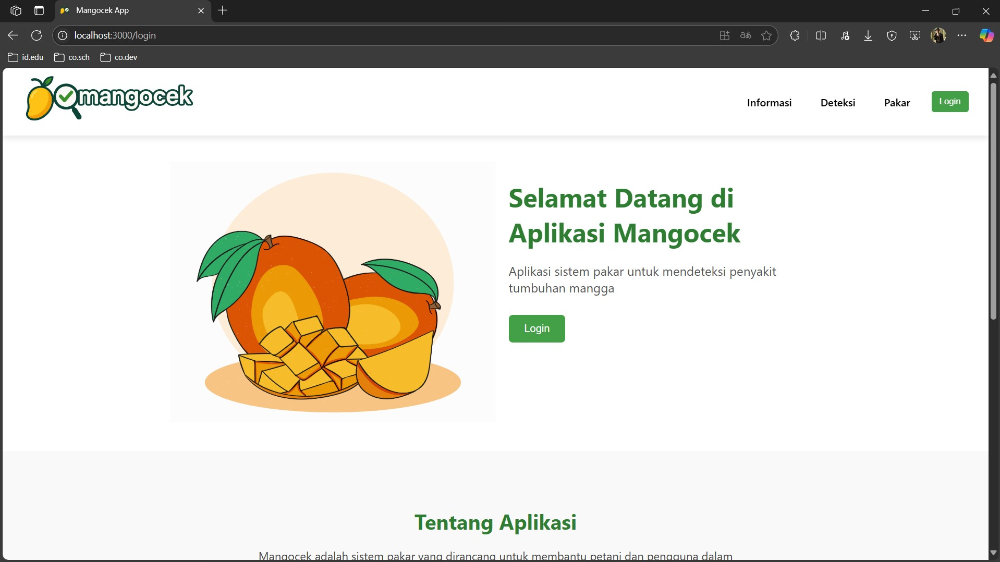
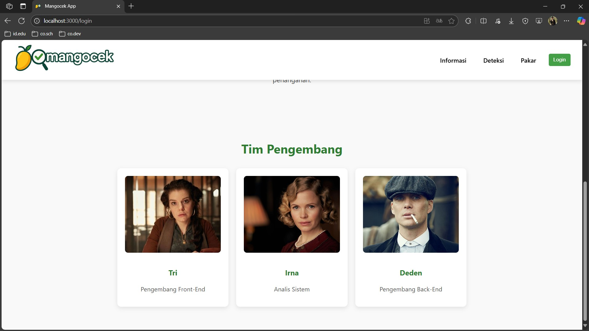
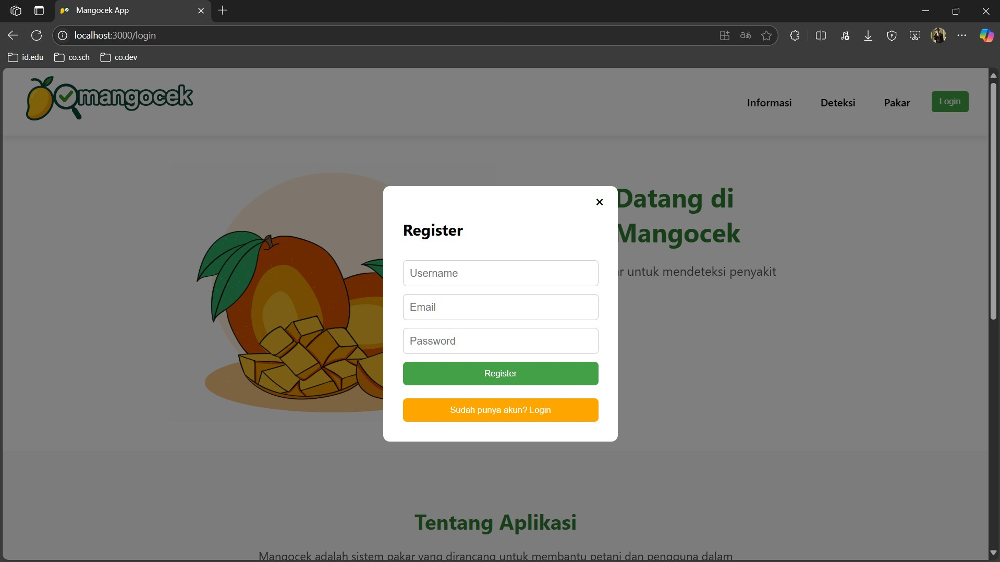
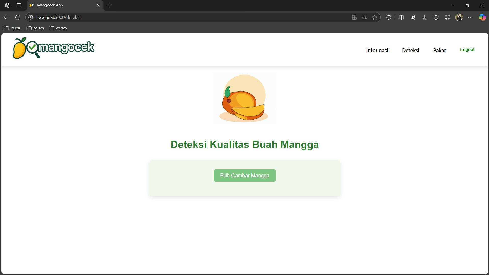
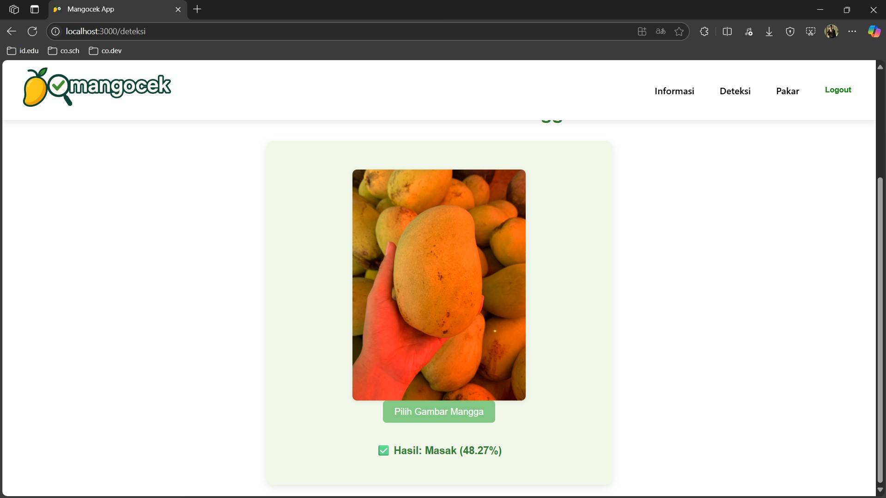

# Mangocek APP

Aplikasi sistem pakar untuk mendiagnosis penyakit tanaman mangga berdasarkan gejala-gejala yang terjadi beserta penanggulangannya. Dilengkapi deteksi kualitas buah mangga menggunakan model CNN dan chatbot AI berbasis Gemini.

## Dokumentasi

- [Dokumentasi API](docs/API.md) — semua endpoint, format request/response, kode status
- [Dokumentasi AI](docs/AI.md) — CNN model, MangoBot (Gemini), alur inferensi

---

<!-- ## Struktur Proyek

```
mangocek-app/
├── frontend/               # React 19 (UI)
├── backend/                # Node.js + Python (API & ML)
│   ├── server.js
│   ├── predict.py
│   ├── cnn_model_mangga.h5
│   ├── requirements.txt
│   ├── .env                # buat sendiri dari .env.example
│   └── .env.example        # template variabel lingkungan
├── database/
│   └── init.sql            # schema + seed data
├── scripts/
│   └── setup-ec2.sh        # script setup Ubuntu EC2
├── docker-compose.yml      # untuk lokal (development)
└── docker-compose.prod.yml # untuk cloud (production) -->
```

---

## Menjalankan Secara Lokal (Docker)

**Prasyarat:** Docker Desktop sudah terinstall dan berjalan.

### 1. Buat file `.env` backend

```bash
cp backend/.env.example backend/.env
```

Edit `backend/.env` dan isi `GEMINI_API_KEY` dengan API key dari Google AI Studio:

```
GEMINI_API_KEY=isi_dengan_api_key_kamu
```

### 2. Build dan jalankan

```bash
docker compose up --build
```

> **Catatan:** Build pertama membutuhkan 10–20 menit karena mengunduh TensorFlow (~600 MB).

| Service  | URL                   |
|----------|-----------------------|
| Aplikasi | http://localhost:3000 |
| API      | http://localhost:5000 |

Akun admin default:
- Email: `admin@mangocek.com`
- Password: `admin123`

### Perintah berguna

```bash
# Jalankan di background
docker compose up --build -d

# Lihat log semua service
docker compose logs -f

# Hentikan semua service
docker compose down

# Hentikan dan hapus data database (reset total)
docker compose down -v
```

---

<!-- ## Deploy ke Cloud (AWS EC2 + GCP Cloud Storage)

### Arsitektur

```
Internet
   │
   ├── Port 80  → EC2 → Docker: frontend (nginx)
   └── Port 5000 → EC2 → Docker: backend (Node.js + Python)
                              │
                    Docker: db (MySQL)  ←── volume lokal
                    GCP Cloud Storage   ←── foto prediksi (opsional)
```

### Langkah 1 — Setup EC2

Buat EC2 instance Ubuntu 22.04, buka port 22 (SSH), 80 (HTTP), dan 5000 (API) di Security Group.

Login ke EC2, lalu jalankan script setup:

```bash
curl -fsSL https://raw.githubusercontent.com/<user>/<repo>/main/scripts/setup-ec2.sh | bash
```

Atau copy file `scripts/setup-ec2.sh` ke EC2 dan jalankan langsung:

```bash
chmod +x scripts/setup-ec2.sh
./scripts/setup-ec2.sh
```

Logout lalu login kembali agar permission docker group aktif.

### Langkah 2 — Clone repo di EC2

```bash
git clone https://github.com/<user>/<repo>.git
cd mangocek-app
```

### Langkah 3 — Buat file konfigurasi

**`backend/.env`** (wajib):

```bash
cp backend/.env.example backend/.env
nano backend/.env
```

Isi minimal:

```
DB_HOST=db
DB_USER=root
DB_PASSWORD=mangocek_root
DB_NAME=mangocek_db
GEMINI_API_KEY=isi_api_key_gemini
```

Untuk mengaktifkan upload foto ke GCP Cloud Storage, tambahkan:

```
GCS_BUCKET_NAME=nama-bucket-kamu
GCS_KEY_FILE=/app/gcs-key.json
```

Lalu taruh file service account JSON GCP di `backend/gcs-key.json`.

**`.env`** (di root, untuk docker-compose.prod.yml):

```bash
cat > .env <<EOF
DB_ROOT_PASSWORD=mangocek_root
DB_NAME=mangocek_db
REACT_APP_API_URL=http://<IP_PUBLIK_EC2>:5000
EOF
```

Ganti `<IP_PUBLIK_EC2>` dengan IP publik EC2 kamu (atau domain jika sudah pakai domain).

### Langkah 4 — Build dan jalankan

```bash
docker-compose -f docker-compose.prod.yml up -d --build
```

| Service  | URL                              |
|----------|----------------------------------|
| Aplikasi | http://\<IP_EC2\>                |
| API      | http://\<IP_EC2\>:5000           |

### Perintah berguna di production

```bash
# Lihat status container
docker compose -f docker-compose.prod.yml ps

# Lihat log
docker compose -f docker-compose.prod.yml logs -f

# Restart semua service
docker compose -f docker-compose.prod.yml restart

# Update kode (setelah git pull)
docker compose -f docker-compose.prod.yml up -d --build

# Hentikan semua
docker compose -f docker-compose.prod.yml down
```

---

## Perbedaan Lokal vs Production

| | `docker-compose.yml` (lokal) | `docker-compose.prod.yml` (cloud) |
|---|---|---|
| API URL frontend | `http://localhost:5000` | `http://<IP_EC2>:5000` |
| Port frontend | 3000 | 80 |
| `restart: always` | tidak | ya |
| GCS upload | opsional | opsional |
| DB password | hardcoded | dari `.env` | -->

---

## Menjalankan Tanpa Docker (Development)

**Prasyarat:** Node.js v18+, Python 3.9+, MySQL lokal, pip

### 1. Siapkan Database

```bash
mysql -u root -p -e "CREATE DATABASE mangocek_db;"
mysql -u root -p mangocek_db < database/init.sql
```

### 2. Jalankan Backend

```bash
cd backend
cp .env.example .env   # lalu edit sesuai konfigurasi MySQL lokal
npm install
pip install -r requirements.txt
node server.js
```

Backend berjalan di `http://localhost:5000`.

### 3. Jalankan Frontend

```bash
cd frontend
npm install
npm start
```

Aplikasi berjalan di `http://localhost:3000`.

---

## Screenshot

#### 1. Landing Page

<!-- 


#### 2. Login / Register



#### 3. Deteksi Page



#### 4. Pakar Page


#### 5. Chatbot


#### 6. Dashboard


 -->
