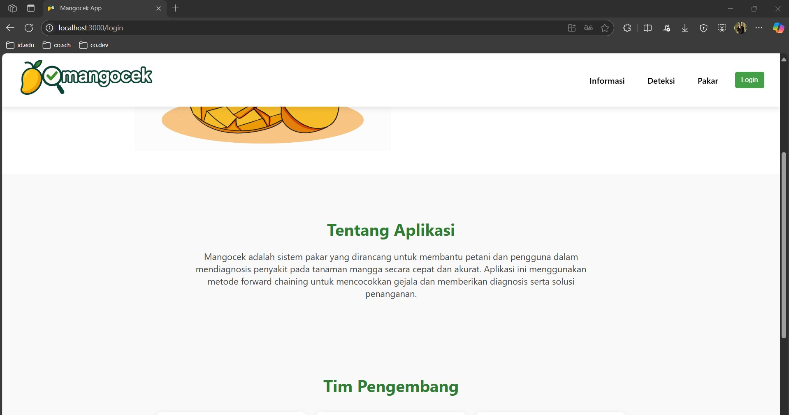
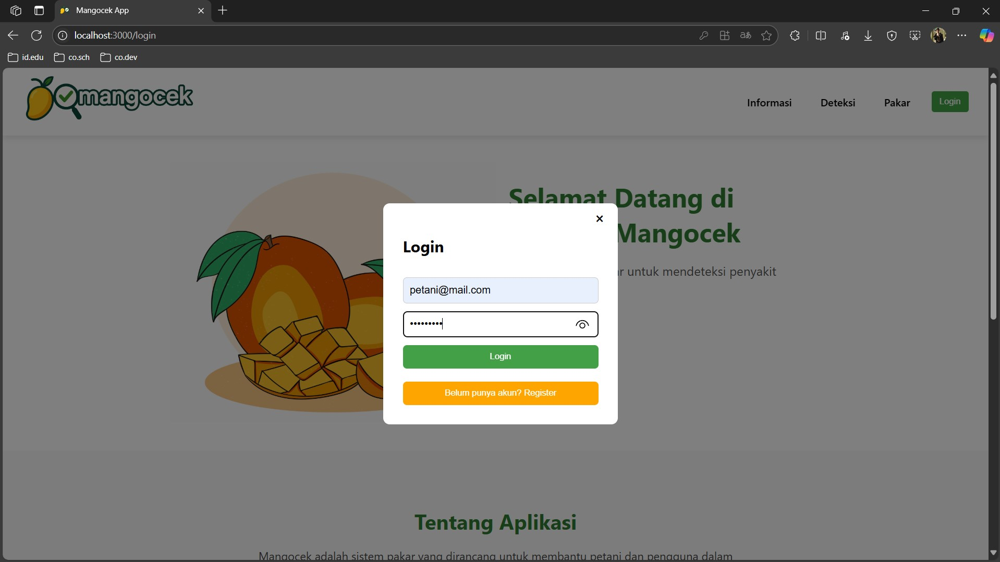
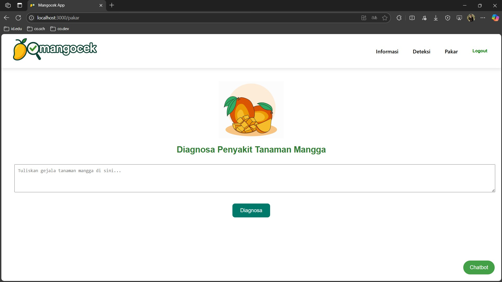
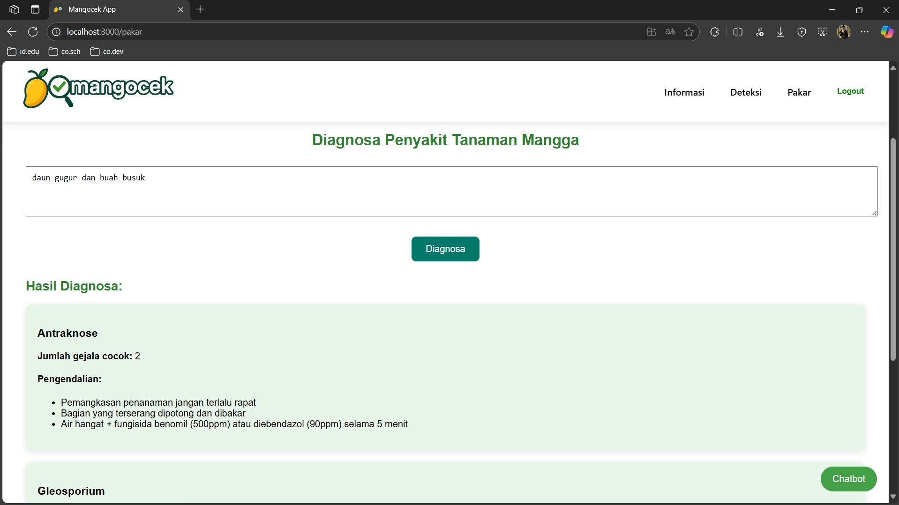
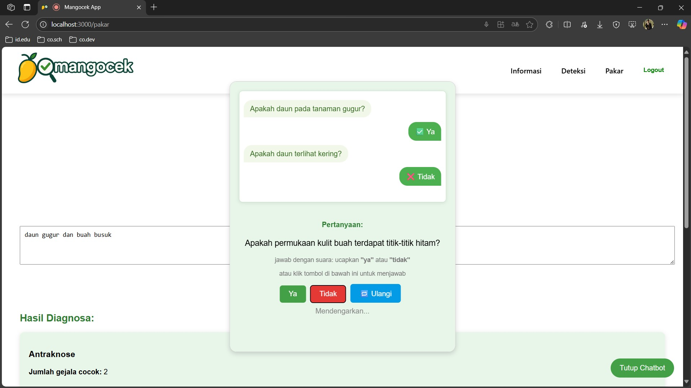
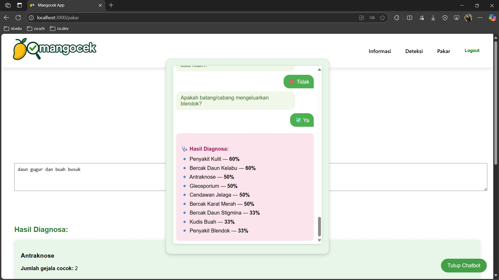
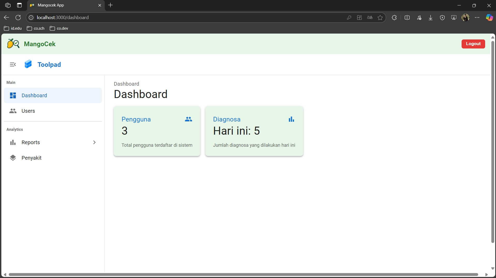
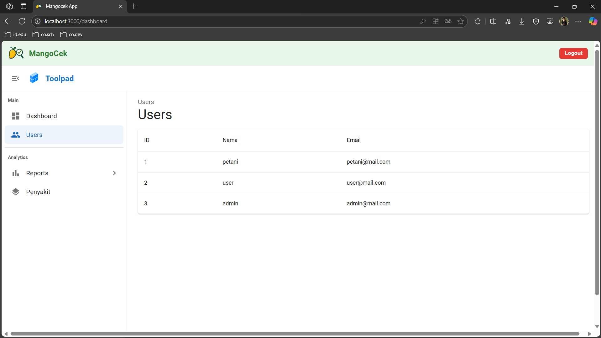
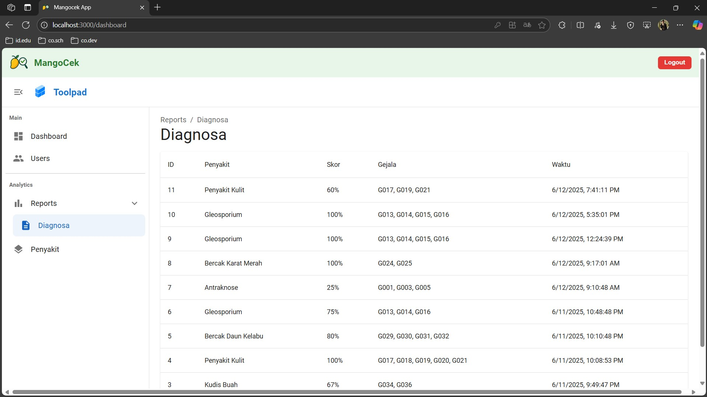
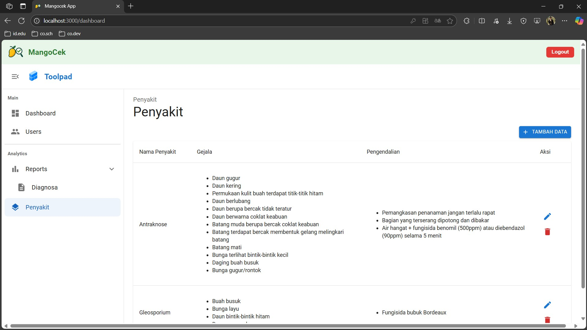

# Mangocek APP

aplikasi sistem pakar untuk mendiagnosis penjakit tanaman mangga berdasarkan gejala-gejala yang terjadi beserta penanggulangannya.

## Cara menjalankan Aplikasi

### Menyalakan Backend

1. Masuk ke direktori backend:
    ```bash
    cd backend
    ```
2. Jalankan backend:
    - Jika ingin ada perubahan otomatis:
        ```bash
        npx nodemon server.js
        ```
    - Atau tanpa perubahan otomatis:
        ```bash
        node server.js
        ```

### Menyalakan Aplikasi

1. Masuk ke direktori aplikasi:
    ```bash
    cd mangocek-app
    ```
2. Jalankan aplikasi:
    ```bash
    npm start
    ```

---

### Screenshot

#### 1. Landing Page




#### 2. Login / Register



#### 3. Deteksi Page


#### 4. Pakar Page



#### 5. Chatbot



#### 5. Dashboard




